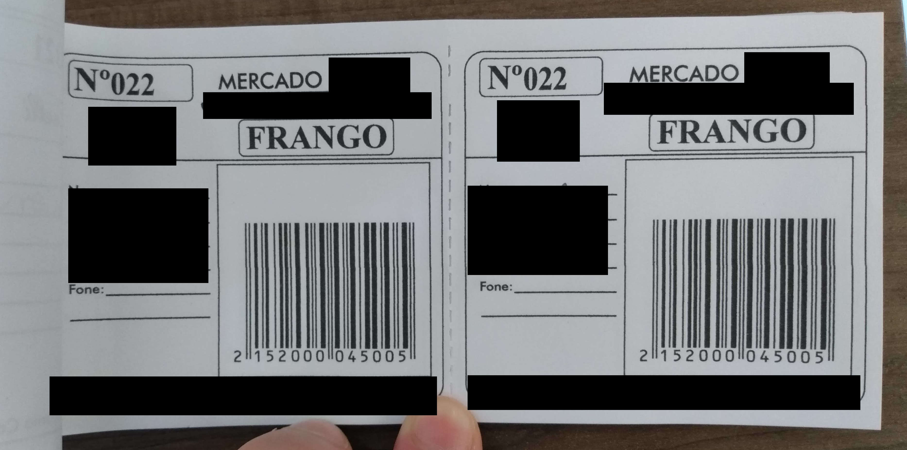
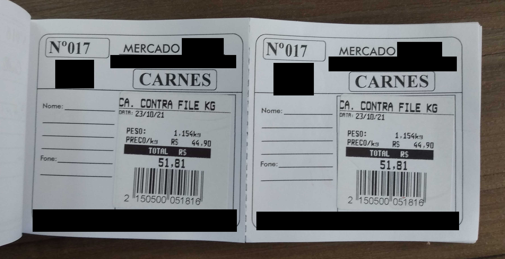

# SaleDay

  My first web application ever! :satisfied: \
  After expending more than 3 months it's finally time to let it go, for the most part the application works but it has a few bugs that I don't intend to fix because this application will never see the light of production, but it was never meant to, this was just an experiment to see what I was capable of doing given a real world problem, now I know that I still have a lot to learn.

## :exclamation: The Problem

Context: There is a small market in my neighbourhood that sells roast chicken and roast meat every sunday. \

meat

 The problem is the way they use to control sale is apart from their main computer system because they need to have control over how many they sold and to who, which their computer system doesn't provide, so the solution for them was to use pen and paper, here are the photos I took(with permission) of their system. \
  \
  \
 > I live in Brazil and we speak portuguese, so let me translate what was written on the photos \
  > Frango = chicken \
  > Carne = meat

  The system for the most part works, but it's a physical object and gets passed around because they take orders by phone, whatsapp and in person, sometimes two people need to have access to it at the same time and that is an opportunity for them to mess up the orders(which have already happened before).

## :star: The Solution

My ideal was to build a system that worked with a smartphone connected to a server that would contain all the orders, customers and products, it needed to have a "sales group" to control the amount of sales peer weekend, update the orders in real time and be easy to write an order down, it also need to work on android and ios devices, so the answer was obvious to me, Flutter the perfect cross platform tool, then I remembered that all I knew was javascript, and a built a web application instead.

## :iphone: How The Application Works

The application starts with a login screen the first time you access it(after login the user section is saved by cookie), to create an user you need to go to the register screen which can be removed later(yes my application is not very secure), after that you can register products and users, the product can have a "subproduct"(the chicken was standart but the meat price was defined by the cut and weight thus making my life more difficult), then you need to create a sale group to determine how much of each product you have available to sell that day(this part where you also put all the meat prices, by reading a barcode), and finally you just need to select the sale group and start making sales, that you can create on the sales tab or by creating or clicking on top of a customer register, the products are defined by tag numbers like their old paper system, not by quantity, for example if we look at a sale with chickens number 2 and 3, it means that sale contains in reality 2 chickens with the tags number 2 and 3. 

https://user-images.githubusercontent.com/59318991/163272139-6e635c14-9d7f-4542-a260-9460407621b1.mp4

If you check the paid button the server will send a print event to another service running in a computer with a thermal printer to print the receipt(in theory). 

## :poop: Behind The Scene(The Code)

  I wrote and rewrote the code multiple times during the first month of development, I started with the idea of using purely javascript, html and css like a naive developer, but i quickly realised it was not possible, not given the time I intended to spend on this project(2 months), then I started to look for a frontend framework and [svelte](https://svelte.dev/) was the one that clicked with me, so I started writing with svelte, but again I realised I needed a router finally switched to [sveltekit](https://kit.svelte.dev/). \
  I learned programming logic with the C language and the missing types in javascript felt wrong to me, when I found [Typescript](https://www.typescriptlang.org/) I fell in love with it. \
  During the development I learned that I'm very, very bad at design, so I decided to use a pre-built design system, and I chose [Carbon](https://carbon-components-svelte.onrender.com/) to do the job. \
  [mongodb](https://www.mongodb.com/) was my database of choice because I didn't really knew SQL and mongodb seemed to be more easy since it was basically javascript objects, now that I know a little bit more about sql I see that mongo was probably not the best choice for this case. \
  Constantly making api requests for changes on the server is not an efficient way to make a real time update app I learned, thankfully I found [Socket.IO](https://socket.io/) to help me with this task. \
To make it look like a professional application I also made it a [PWA](https://web.dev/progressive-web-apps/) , but I learned that to install a pwa you need to serve the website via https, since the app was designed to run on a local network I don’t know if it is possible, but you can install it locally at least.
Finally the last big piece of software that was used in the project was [Docker](https://www.docker.com/), because it is very cool to know docker.

## :running: How To Run The Application

To run it locally you just need to run `docker-compose up -d —build` in the project folder, but if you want to run on the local network you will need to change the ip on the [frontend/server_ip.json](frontend/server_ip.json) and [backend/Dockerfile](backend/Dockerfile) files.

## :upside_down_face: Mistakes That Now I Know I Did

  To start, if you look at the code the first thing you notice is that there is no test, not a single one, and after spending hours on end to find bugs I realised that tests are not only important but essential to a project(I want my time back please). \
  My code doesn't have a clear pattern, and this led to a lot of confusion in how to make things when I was building it. For the most part I looked to examples on the internet to know how to build each piece of the application, but in the end it became a huge mess.

## :thinking: Conclusion

Building a webapp is very difficult, I mean my app is full of problems, runs locally and it still took me a lot of time to make it. After this experience my objective is to study the different patterns and algorithms, structure the code the right way and learn how to do proper testing to make my future life easier.
